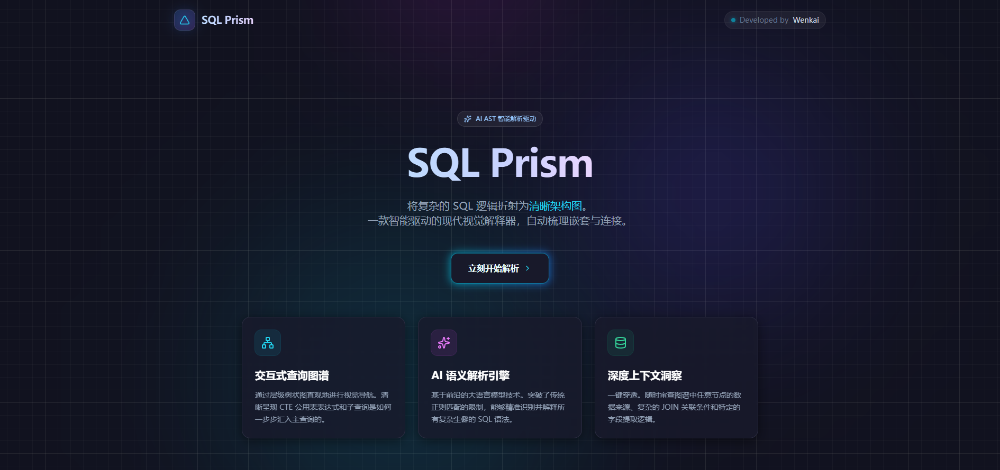

# SQL Prism

<div align="center">
  
</div>

## Overview

SQL Prism is a modern visual SQL query analyzer that transforms complex, nested SQL statements into clear, navigable visual structures. Powered by AI, it automatically parses SQL syntax trees, identifies query components, and renders interactive dependency graphs — making even the most intricate queries understandable at a glance.

## Features

- **AI-Powered Analysis** — Leverages Google's Gemini AI to deeply understand SQL semantics and extract meaningful query structures
- **Interactive AST Inspector** — Click any node in the graph to inspect its details, column lineage, and associated SQL snippet
- **Smart Snippet Highlighting** — Selected query blocks are highlighted in context with neon-style visual cues
- **Visual Query Graph** — Force-directed graph visualization of query dependencies using D3.js
- **Resizable Panels** — Three-panel layout (SQL Editor, Inspector, Visualization) with drag-to-resize handles
- **Cyberpunk Dark Theme** — A polished, modern UI with neon accents optimized for long coding sessions

## How It Works

1. **Input** — Paste any SQL query (SELECT, WITH clauses, JOINs, subqueries) into the left editor panel
2. **Analyze** — Click "解析" to send the query to the Gemini AI backend
3. **Visualize** — The query is parsed into nodes (CTEs, Subqueries, Joins, Aggregations) and rendered as an interactive graph
4. **Inspect** — Click any node to see its SQL snippet, columns, and metadata in the inspector panel
5. **Navigate** — The editor auto-scrolls to highlight the corresponding SQL when you select a node

## Tech Stack

- **Frontend**: React 19, TypeScript, Vite
- **Visualization**: D3.js (force-directed graph)
- **AI**: Google Gemini API (`@google/genai`)
- **Icons**: Lucide React
- **Animation**: Motion

## Getting Started

### Prerequisites

- Node.js 18+
- A Google Gemini API key

### Installation

```bash
npm install
```

### Configuration

Create a `.env.local` file in the project root:

```
GEMINI_API_KEY=your_api_key_here
```

### Development

```bash
npm run dev
```

Open [http://localhost:5173](http://localhost:5173) in your browser.

### Build

```bash
npm run build
```

## Project Structure

```
├── App.tsx                  # Main application with landing page & query analyzer
├── index.tsx               # React entry point
├── components/
│   ├── LandingPage.tsx     # Welcome screen with logo & start button
│   ├── QueryVisualizer.tsx # D3 force-directed graph visualization
│   └── AstInspector.tsx    # Right panel: node metadata & snippet display
├── services/
│   └── aiService.ts        # Gemini API integration for SQL parsing
├── types.ts                # TypeScript interfaces (AnalysisResult, SqlNode, etc.)
├── metadata.json           # App metadata (name, description)
└── assets/
    └── sql-prism.png        # Hero image
```

## License

MIT
